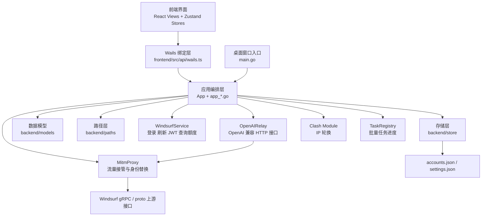
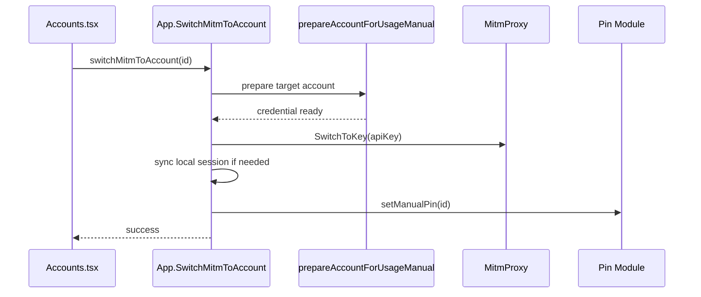
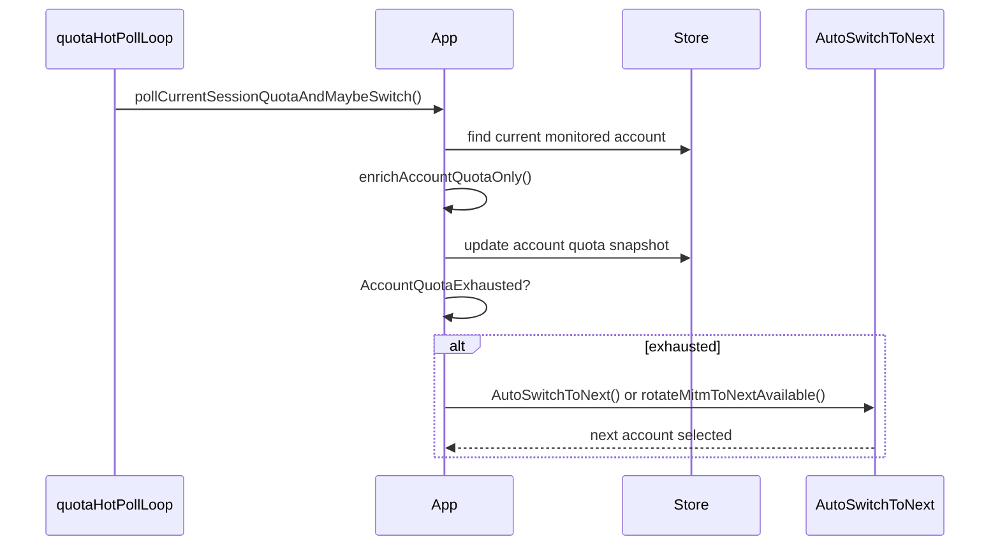
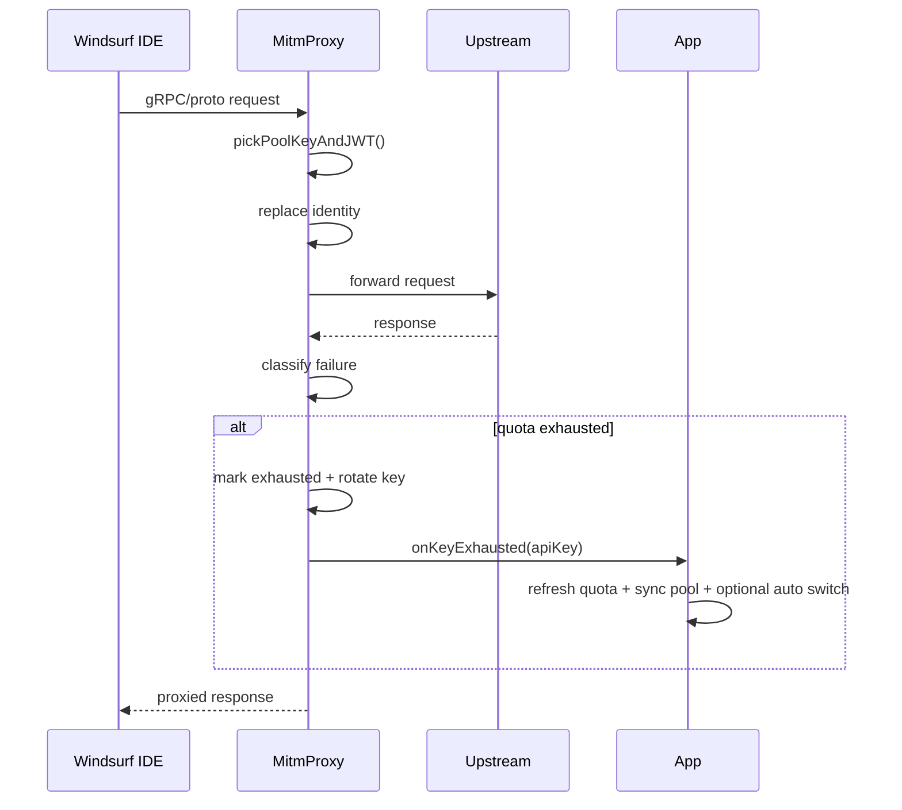

# Windsurf Tools 架构详解

> 更新时间：2026-05-18
>
> 这份文档基于当前仓库真实代码整理，重点覆盖：
> - 项目整体架构与分层
> - 账号池与配置存储
> - 额度同步 / 额度恢复判定
> - 文件切号与 MITM 无感切号
> - 桌面运行态与 OpenAI Relay 的关系
> - 后续适合继续拆分和演进的方向
>
> 补充说明：当前桌面前端产品路径已经收口为“纯 MITM 工作流”，主界面默认暴露总览、号池、用量、OpenAI Relay、清理、设置、帮助与关于。`windsurf_auth.json` 文件切号链路仍作为后端兼容能力存在，但已经不是当前桌面壳的主入口。

---

## 1. 项目定位

`windsurf-tools-wails` 是一个基于 **Wails v2** 的桌面应用，技术栈为：

- 后端：Go
- 桌面壳：Wails
- 前端：React 18 + Zustand + Vite + TailwindCSS

项目核心目标不是单纯“管理账号”，而是围绕 Windsurf 的多账号使用场景，提供一整套本地控制面。当前前端产品主线已经固定为纯 MITM 模式：

- 账号池导入与管理
- Token / JWT / API Key 凭证维护
- 套餐与额度同步
- 额度用尽后的自动切号
- MITM 无感换号
- OpenAI 兼容中转
- 静默启动与托盘后台运行

从架构视角看，它本质上是一个本地“控制器”：

- 用 JSON 文件保存账号池和配置
- 用 Go 服务层负责和 Windsurf / Firebase / Codeium 接口打交道
- 用 Wails 把这些能力暴露给前端界面
- 当前前端主入口通过 MITM / Relay 控制实际身份
- 仓库内部仍保留 `windsurf_auth.json` 相关能力作为历史兼容链路

---

## 2. 总体分层

可以把这个项目理解成 4 层：

1. 展示层：React 页面、组件、Zustand stores。
2. 调用层：Wails 自动生成绑定，前端统一通过 `APIInfo` 调 Go 方法。
3. 编排层：`App` 和 `app_*.go`，负责把“账号、额度、切号、MITM、服务”串起来。
4. 能力层：`backend/services`、`backend/store`、`backend/utils`，提供真正的底层能力。

---

## 3. 入口与运行态

### 3.1 桌面态入口

文件：`main.go`

桌面态会：

- 创建 `App`
- 启动 Wails 窗口
- 绑定 `App` 给前端
- 注册单实例锁
- 处理 `--silent` / `--silent-start`

关键点：

- 这是用户平时看到的完整 GUI 应用。
- 启动后会执行 `app.startup()`。
- 前端与后端之间没有 HTTP API，直接通过 Wails 绑定通信。

### 3.2 静默启动与托盘运行

当前入口仍是 Wails 桌面态。`main.go` 支持 `--silent` / `--silent-start`，由 `App.SetSilentFromFlag` 传入运行态；托盘、窗口关闭行为和退出清理由 `tray*.go`、`app_window.go`、`app_lifecycle.go` 协同处理。

静默 / 托盘运行特点：

- 仍然执行 `initBackend()`
- 可按设置恢复 MITM、Relay、Clash、轮换池等运行态
- 窗口可以隐藏到托盘，但业务组件仍在同一桌面进程内运行
- 退出时由 `cleanupOnce` 保证 MITM 环境清理只跑一次

---

## 4. 目录与职责

### 4.1 根目录核心文件

- `app.go`
  - `App` 聚合对象
  - 初始化 Store / Service / MITM / Relay
  - 启动与关闭逻辑
- `app_accounts.go`
  - 账号列表、删除、导出、按计划清理
- `app_enrich.go`
  - 账号信息与额度信息丰富化
- `app_import.go`
  - 导入邮箱密码 / JWT / API Key / RefreshToken
- `app_mitm.go`
  - MITM 开关、CA、Hosts、调试 dump
- `app_quota.go`
  - 凭证刷新、额度刷新、热轮询、自动切号
- `app_relay.go`
  - OpenAI Relay 开关与状态
- `app_settings.go`
  - 设置读写及副作用联动
- `app_switch.go`
  - 手动切号、自动切号、候选选择、预热
- `app_tasks.go`
  - 批量任务注册、进度快照与前端 TaskDrawer 轮询

### 4.2 `backend/` 目录

- `backend/models`
  - 数据结构定义
- `backend/store`
  - JSON 存储
- `backend/services`
  - 对外部系统与本地系统的操作能力
- `backend/utils`
  - 额度判断、刷新策略、计划分类、时间计算
- `backend/paths`
  - 配置目录解析与旧目录迁移

### 4.3 `frontend/src`

- `App.tsx`
  - 主壳，切换主界面与 toolbar 模式
- `views/Accounts.tsx`
  - 切号、额度刷新、导入、号池管理主界面
- `views/Settings.tsx`
  - 自动刷新、自动切号、MITM、Relay、Clash、调试等设置入口
- `views/Relay.tsx`
  - OpenAI 中转界面
- `components/MitmPanel.tsx`
  - MITM 状态、CA/Hosts 配置、开关
- `stores/*`
  - Zustand 状态层
- `api/wails.ts`
  - 前端调用 Go 的统一入口

---

## 5. 数据模型

### 5.1 Account

文件：`backend/models/account.go`

账号模型除了基本身份信息，还包含：

- 凭证字段
  - `Token`
  - `RefreshToken`
  - `WindsurfAPIKey`
  - `Email`
  - `Password`
- 套餐 / 额度字段
  - `PlanName`
  - `UsedQuota`
  - `TotalQuota`
  - `DailyRemaining`
  - `WeeklyRemaining`
  - `DailyResetAt`
  - `WeeklyResetAt`
- 生命周期字段
  - `SubscriptionExpiresAt`
  - `TokenExpiresAt`
  - `LastQuotaUpdate`
  - `LastLoginAt`
  - `CreatedAt`

这说明账号池不是“只存凭证”，而是把运行态元数据也一起缓存下来了。

### 5.2 Settings

文件：`backend/models/settings.go`

设置里真正决定系统行为的几组字段有：

- 刷新策略
  - `AutoRefreshTokens`
  - `AutoRefreshQuotas`
  - `QuotaRefreshPolicy`
  - `QuotaCustomIntervalMinutes`
- 自动切号
  - `AutoSwitchPlanFilter`
  - `AutoSwitchOnQuotaExhausted`
  - `SwitchStrategy`
  - `SwitchCooldownEnabled`
  - `ManualPinEnabled`
  - `RotationPoolEnabled`
  - `QuotaHotPollSeconds`
- MITM
  - `MitmDebugDump`
  - `MitmFullCapture`
  - `StaticCacheIntercept`
  - `MitmJailbreakEnabled`
  - `SmartFriendEnabled`
- Relay / Clash / 桌面行为
  - `OpenAIRelayEnabled`
  - `OpenAIRelayPort`
  - `OpenAIRelaySecret`
  - `ClashRotateEnabled`
  - `MinimizeToTray`
  - `DesktopNotifications`
  - `WindowWidth` / `WindowHeight` / `WindowX` / `WindowY`

这些字段决定了额度同步与切号逻辑的大部分分支。

---

## 6. 存储层设计

文件：`backend/store/store.go`

### 6.1 存储形式

项目使用本地 JSON 文件持久化：

- `accounts.json`
- `settings.json`

目录由 `backend/paths/appdir.go` 统一解析，默认位于用户配置目录下的 `WindsurfTools`。

### 6.2 存储特点

- 用 `sync.RWMutex` 保护读写
- 每次更新后立即落盘
- 使用 `atomicWriteFile()` 先写 `.tmp` 再 rename，降低 JSON 损坏风险
- 启动时自动兼容旧版目录 `windsurf-tools-wails`

### 6.3 设计含义

优点：

- 简单直接
- 本地可迁移
- 排障方便

代价：

- `App` 层会频繁读写整个账号对象
- 没有更细粒度的索引或事件流
- 适合单机控制面，不适合复杂多进程共享写入

---

## 7. 前后端边界

### 7.1 前端怎么调后端

文件：`frontend/src/api/wails.ts`

前端所有关键动作都经由 `APIInfo` 发起，例如：

- `switchMitmToNext`
- `switchMitmToAccount`
- `switchAccountLocal`
- `refreshAllTokens`
- `refreshAllQuotas`
- `refreshAccountQuota`
- `startMitmProxy`
- `stopMitmProxy`
- `getMitmProxyStatus`
- `getSettings`
- `updateSettings`
- `getOpenAIRelayStatus`
- `getUsageSummary`
- `listTasks`
- `runDiagnostics`
- `saveWindowGeometry`

### 7.2 分层特点

前端负责：

- 展示
- 用户交互
- 状态回填
- 操作结果提示

后端负责：

- 真正的业务判断
- 凭证刷新
- 额度计算与判断
- 自动切号
- MITM 控制
- 服务控制

也就是说，这个项目不是“前端业务重，Go 只是桥接”，而是“Go 业务重，前端只是控制面”。

---

## 8. `App` 编排层

文件：`app.go`

`App` 是整个项目最重要的编排对象。它持有：

- `store`
- `windsurfSvc`
- `mitmProxy`
- `openaiRelay`
- `rotationPool`
- `usageTracker`
- `notifier`
- `pinMod`
- `clashMod`
- `importMod`
- `tasks`
- `switchHistory`

并在 `initBackend()` 中完成初始化、联动与回调绑定。

### 8.1 `initBackend()` 做了什么

1. 创建 Store
2. 读取 Settings
3. 创建 `WindsurfService`
4. 创建 `TaskRegistry` 与切号历史存储
5. 创建桌面通知、Pin、UsageTracker
6. 创建 `MitmProxy` 与 `OpenAIRelay`
7. 注册 MITM / Relay 回调
8. 创建导入模块与 Clash 轮换模块
9. 把 settings 推送到 MITM、Relay、Clash、缓存、破限注入、SmartFriend 等运行态组件
10. 根据设置启动：
   - 自动 token 刷新
   - 自动额度刷新
   - 当前会话热轮询
   - OpenAI Relay
   - Clash 轮换
   - 轮换池

### 8.2 为什么它重要

因为这个项目很多能力不是独立运行，而是互相反馈：

- MITM 发现某 key 见底
- 回调 App 刷新对应账号额度
- 刷新后同步 MITM 号池
- 若设置开启，再触发自动切号

这个闭环全靠 `App` 串起来。

---

## 9. WindsurfService：外部接口适配层

文件：`backend/services/windsurf.go`

这个服务负责与外部接口交互，主要能力分三类。

### 9.1 Firebase 凭证链路

- `LoginWithEmail()`
- `RefreshToken()`
- `GetAccountInfo()`

用途：

- 通过邮箱密码登录
- 用 RefreshToken 刷新 Firebase ID token
- 查当前账号邮箱

### 9.2 Windsurf / Codeium 业务链路

- `RegisterUser()`
- `GetCurrentUser()`
- `GetPlanStatus()`
- `GetPlanStatusJSON()`
- `GetUserStatus()`

用途：

- 获取 API Key
- 查询计划状态
- 查询当前额度

### 9.3 JWT 处理链路

- `GetJWTByAPIKey()`
- `DecodeJWTClaims()`

用途：

- 从 `sk-ws-*` API Key 换取 JWT
- 从 JWT 中恢复 email / plan / teams tier 等信息

### 9.4 设计特点

它并不是一个纯 REST 客户端，而是混合了：

- Firebase HTTP
- Windsurf JSON API
- Connect / gRPC / protobuf

所以它本质上是一个“多协议适配器”。

---

## 10. 额度同步与额度恢复逻辑

这是项目里最关键的一组逻辑之一。

### 10.1 核心目标

系统希望同时解决两个问题：

1. 号池整体额度信息不能太旧
2. 当前正在使用的账号必须尽快发现额度用尽并切号

因此代码分成了两条通道：

- 慢速、面向全号池的定期刷新
- 快速、只盯当前账号的热轮询

### 10.2 定期刷新

文件：`app_quota.go`

`startAutoQuotaRefresh()` 会每 5 分钟执行一次 `refreshDueQuotas()`。

`refreshDueQuotas()` 的流程：

1. 读取设置
2. 检查 `AutoRefreshQuotas`
3. 根据 `QuotaRefreshPolicy` 过滤出“该刷新”的账号
4. 分批并发执行：
   - 同步凭证
   - 拉取额度和计划
5. 回写 Store
6. 如果号池更新了，则 `syncMitmPoolKeys()`
7. 如果当前号已见底，则尝试自动切号

### 10.3 “何时该刷新”的判定

文件：`backend/utils/quota_refresh.go`

支持策略：

- `hybrid`
  - 24 小时到期，或者美东跨日
- `interval_24h`
- `us_calendar`
- `local_calendar`
- `interval_1h`
- `interval_6h`
- `interval_12h`
- `custom`

也就是说，这里的“额度恢复”并不是被服务端主动通知，而是本地用策略定期重查，推断额度可能已经恢复。

### 10.4 当前会话热轮询

`restartQuotaHotPollIfNeeded()` 会在下面两个条件同时成立时启动热轮询：

- `AutoRefreshQuotas == true`
- `AutoSwitchOnQuotaExhausted == true`

热轮询流程在 `pollCurrentSessionQuotaAndMaybeSwitch()`：

1. 读取当前 MITM / 本地会话状态
2. 判断当前监控对象是谁
   - 优先匹配当前 MITM key
   - 兼容文件登录态匹配
3. 只刷新当前账号的额度
4. 更新 Store
5. 若额度见底，则立即切号
6. 通过 12 秒冷却窗口防抖

### 10.5 额度数据怎么获取

文件：`app_enrich.go`

项目有两种 enrich 路径：

- `enrichAccountQuotaOnly()`
  - 只做额度相关检查
  - 用于热轮询
- `enrichAccountInfoWithService()`
  - 做更完整的账号信息与额度同步
  - 用于导入、全量刷新、单号刷新

额度获取优先级：

1. 有 API Key
   - 优先走 `GetUserStatus()` gRPC
2. gRPC 失败或拿不到关键百分比
   - 尝试 `RefreshToken` 或 `LoginWithEmail`
   - 再走 `GetPlanStatusJSON()` 兜底

### 10.6 额度“见底”的统一判断

文件：`backend/utils/quota_exhausted.go`

规则：

- 若 `TotalQuota > 0` 且 `UsedQuota >= TotalQuota`，视为见底
- 若 `DailyRemaining <= 0`，视为见底
- 若 `WeeklyRemaining <= 0`，视为见底

这里非常关键的一点是：

- 周额度为 0 时，即使日额度还有余量，也会被判定为见底

这和上游行为保持一致。

### 10.7 “额度恢复”的本地推断

文件：`app_switch.go`

`quotaDataIsStale()` 规定：

- 只有已经见底的账号才谈“是否过期”
- 如果 `LastQuotaUpdate` 超过 4 小时，或从未同步过，就认为额度数据可能已恢复

然后这些账号不会被永久排除，而是会重新进入候选集，在切号前通过 `prewarmCandidates()` 再查一次。

这就是当前仓库里最接近“额度恢复逻辑”的地方：

- 不是主动恢复
- 不是严格按 reset_at 定时恢复
- 而是“见底账号在缓存过期后可重新参加候选，再实时验证”

---

## 11. 凭证同步逻辑

文件：`app_quota.go`

`syncAccountCredentialsWithService()` 的优先级非常明确：

1. 若有 `WindsurfAPIKey`
   - 调 `GetJWTByAPIKey()`
2. 否则若有 `RefreshToken`
   - 调 `RefreshToken()`
3. 否则若有 `Email + Password`
   - 调 `LoginWithEmail()`

设计含义：

- API Key 是最快也最适合 MITM 的凭证
- RefreshToken 是次优路径
- 邮箱密码是最后兜底

这个优先级会直接影响：

- 导入后能否快速拿到 JWT
- 自动切号时的准备成本
- 额度查询能不能走最快路径

---

## 12. 切号候选与调度逻辑

文件：`app_switch.go`、`app_mitm.go`、`app_rotation_pool.go`

### 12.1 手动 MITM 切号

`SwitchMitmToAccount(id)` 流程：

1. 从 Store 取目标账号
2. 走 `prepareAccountForUsageManual()`，允许用户明确选择的账号绕过本地额度拦截
3. 清除该账号的冷却惩罚
4. `switchMitmAccountAndSyncLocalSession()` 切换 MITM key 并按需同步本地会话
5. 成功后 `setManualPin(id)`，暂停自动切换通道

### 12.2 自动切到下一席位

自动轮换主要由三类入口触发：

1. MITM 响应识别额度耗尽后触发 `onKeyExhausted`
2. 当前会话热轮询发现额度见底
3. 轮换池定时任务到期

自动路径会走候选筛选、预热、实时额度校验和冷却策略；与手动切号不同，自动轮换不会写入 ManualPin。

### 12.3 候选选择策略

文件：`app_switch.go`

筛选条件：

- 跳过当前账号
- 跳过 `disabled` / `expired`
- 必须有可用凭证
- 必须匹配计划筛选
- 必须当前未见底，或见底但额度缓存已过期

排序策略：

- 先新鲜候选
- 再过期候选
- 同组内按凭证优先级：
  - `Token`
  - `WindsurfAPIKey`
  - `RefreshToken`
  - `Email + Password`

### 12.4 准备目标账号

`prepareAccountForUsage()` 会：

1. 检查状态是否合法
2. 判断是否 30 秒内刚预热过
3. 若没有，则再同步凭证和额度
4. 确保最终有有效 token
5. 若实时检查发现额度已见底，则直接跳过

这一步保证自动切号不会切到“账面上看可用，但实际已经没额度”的账号。

---

## 13. `windsurf_auth.json` 写入机制

文件：`backend/services/switch.go`

这是文件切号可靠性的关键。

### 13.1 路径解析

`SwitchService` 会按平台解析 `windsurf_auth.json` 路径。

Windows 典型路径：

- `%APPDATA%\.codeium\windsurf\config\windsurf_auth.json`

### 13.2 写入步骤

`WriteAuthFile()` 流程：

1. 确保目录存在
2. 若原文件存在则先备份
3. 生成新的 auth JSON
4. 尝试直接写入
5. 失败则改为 `.tmp + rename`
6. Windows 下再失败则调用 PowerShell 强写
7. 最后回读校验 token 是否真的落盘

### 13.3 为什么这样设计

因为运行中的 Windsurf 可能持有文件锁，或者出现某些 Windows 下直写不稳定的情况。当前实现的目标不是“优雅”，而是“尽可能写进去并确认不是假成功”。

---

## 14. MITM 无感切号逻辑

文件：`backend/services/proxy.go`

这是项目另一条最核心的主链路。

### 14.1 MITM 的职责

MITM 不只是转发代理，它做了三件事：

1. 接管 Windsurf 的请求
2. 替换其中的 API Key / JWT 身份
3. 在运行时根据上游返回结果做轮换与恢复

### 14.2 启动条件

MITM 启动前依赖：

- 号池里至少要有可用 API Key
- 本机 CA 可生成
- 本地监听端口可绑定
- Hosts / 证书 / 系统配置可按需要布置

### 14.3 运行时状态

每个 API Key 对应一个 `PoolKeyState`，维护：

- 是否健康
- 是否运行时见底
- 冷却时间
- 请求次数
- 成功次数
- 总耗尽次数
- 当前缓存 JWT

### 14.4 请求处理

`handleRequest()` 的关键步骤：

1. 检查是否为 proto / gRPC 请求
2. 读取 body
3. `pickPoolKeyAndJWT()`
4. `ReplaceIdentityInBody()`
5. 强制覆盖 `Authorization`
6. 在请求头里记录本次使用的 key 供响应阶段追踪

### 14.5 响应处理

`handleResponse()` 的关键步骤：

1. 判断是不是 billing / chat 相关响应
2. 小响应体直接整体读取分析
3. 流式响应用 `quotaStreamWatchBody` 边转发边看是否出现 quota exhausted
4. 对 `GetUserJwt` 响应中的 JWT 进行捕获缓存
5. 根据结果更新 key 状态

### 14.6 运行时轮换

如果 MITM 在真实请求里识别到额度耗尽：

1. 当前 key 标记为 runtime exhausted
2. 立即 `rotateKey()`
3. 同步本地 Codeium config 到新的 key
4. 触发 `onKeyExhausted` 回调给 App

随后 App 会：

1. 尝试刷新对应账号额度
2. 更新 Store
3. 根据设置决定是否继续自动切号

这就是 MITM 路径里“流量层发现问题，控制层回写号池”的闭环。

### 14.7 本地会话同步

当前主链路是 MITM 代理层切号，同时会在必要时同步本地 Codeium config / session：

- 手动切到指定账号时会自动 Pin
- 自动轮换不会触发 Pin
- `shouldSyncMitmLocalSessionOnKeyChange` 决定哪些原因需要同步本地会话
- 文件登录态链路保留为兼容入口

因此当前切号主要发生在代理层，本地文件同步只是辅助兼容。

---

## 15. OpenAI Relay

文件：`backend/services/openai_relay.go`

Relay 的定位是：

- 提供本地 OpenAI 兼容接口
- 底层复用 MITM 的账号池与 JWT 轮换能力

### 15.1 能力

- `GET /v1/models`
- `POST /v1/chat/completions`
- 支持 Bearer 鉴权
- 支持流式 SSE

### 15.2 与 MITM 的关系

它不是独立账号池，而是复用 MITM：

- 从 MITM 拿当前 key / JWT
- 请求上游时沿用相同轮换策略
- 成功后回调 App 刷新额度

因此 Relay 可以视作“MITM 号池的一种外部 HTTP 暴露形式”。

---

## 16. 设置变更的副作用

文件：`app_settings.go`

`UpdateSettings()` 不只是保存配置，它还会联动触发真实副作用：

- 重建 `WindsurfService`
- 如代理配置变化，重启 MITM
- 按开关启动或停止自动 token 刷新
- 按开关启动或停止自动额度刷新
- 重启热轮询
- 同步 MITM 号池
- 同步 Forge、静态缓存、破限注入、SmartFriend、抓包 / dump 开关
- 应用 OpenAI Relay、Clash 轮换、轮换池设置
- 切换 debug 日志

这说明 Settings 并不是“静态配置”，而是当前运行态行为控制器。

---

## 17. 诊断、日志与任务体系

相关文件：`app_diagnose.go`、`backend/app/diagnose`、`app_tasks.go`、`frontend/src/components/TaskDrawer.tsx`

### 17.1 平台诊断

`RunDiagnostics()` 会聚合平台能力检查：

- 桌面通知
- 文件管理器打开能力
- 提权能力
- CA 证书工具
- 应用数据目录可写性
- Windsurf 安装路径
- Clash 控制器
- Windows WebView2

这些结果会在 Dashboard 里以可读的修复提示展示。

### 17.2 调试日志

调试日志由 `utils.InitDebugLogger` 控制：

- UI 的「调试日志」开关写入 `settings.DebugLog`
- `WINDSURF_TOOLS_DEBUG_STDOUT=1` 可在开发时强制输出到 stderr
- 日志文件写入应用数据目录的 `debug.log`

### 17.3 任务进度

`TaskRegistry` 负责批量导入、批量刷新等长任务的运行态快照。前端 `TaskDrawer` 周期性拉取任务列表，展示进度、成功 / 失败计数和最近错误。

---

## 18. 前端页面如何映射到后端能力

### 18.1 Accounts 页面

文件：`frontend/src/views/Accounts.tsx`

负责：

- 手动切号
- 下一席位切号
- 单账号额度刷新
- 全号池额度刷新
- Token 刷新
- 删除 / 清理账号

### 18.2 Settings 页面

文件：`frontend/src/views/Settings.tsx`

负责：

- 自动刷新策略
- 自动切号策略
- 热轮询、Manual Pin、轮换池等行为控制
- MITM / 抓包 / 静态缓存 / 破限注入
- Relay、Clash、调试日志、窗口与托盘偏好

### 18.3 MITM 面板

文件：`frontend/src/components/MitmPanel.tsx`

负责：

- 启停 MITM
- 安装 CA
- 配置 Hosts
- 卸载 MITM 环境
- 查看当前 key、号池健康和最近事件

### 18.4 Relay 页面

文件：`frontend/src/views/Relay.tsx`

负责：

- 启停 OpenAI Relay
- 展示 Base URL / Endpoint
- 给出 curl / Python 调用示例

---

## 19. 关键时序

### 19.1 手动 MITM 切号时序

### 19.2 当前账号额度用尽后的自动切号

### 19.3 MITM 流量层轮换

---

## 20. 当前架构的优点

- 前后端边界清晰，Go 真正掌控业务
- MITM 切号是主链路，文件登录态同步作为兼容链路保留
- 额度同步和切号逻辑已经形成闭环
- 诊断、任务进度、通知、窗口记忆等桌面控制面能力已形成闭环
- Relay 复用现有号池能力，没有重复造轮子

---

## 21. 当前架构的主要耦合点

虽然功能已经比较完整，但当前最主要的耦合集中在 `App`：

- `App` 同时知道
  - 额度刷新
  - 切号策略
  - MITM 回调
  - 设置副作用
  - Relay 联动
  - Clash / Pin / RotationPool / Task 联动

这会带来两个问题：

- 业务决策分散在多个 `app_*.go` 文件里，但最终仍通过 `App` 强耦合
- 后续要扩展“更复杂的切号策略”时，容易继续往 `App` 堆逻辑

---

## 22. 后续推荐演进方向

### 22.1 第一优先级：拆出策略层

建议新增独立策略对象，把“什么时候切、切谁、如何恢复候选”从 `App` 中拆出来，例如：

- `QuotaPolicyService`
- `SwitchPolicyService`
- `PoolSelectionService`

这样能明显降低：

- `app_quota.go`
- `app_switch.go`
- `app.go`

之间的隐式耦合。

### 22.2 第二优先级：统一“当前会话解析”

现在“当前是谁”主要有两类信号：

- MITM 当前 key
- 兼容链路中的本地登录态 / Codeium config

建议抽出统一的 `CurrentSessionResolver`，避免后面更多地方重复做：

- auth 匹配
- key 匹配
- email 匹配
- JWT claim 匹配

### 22.3 第三优先级：把额度恢复从“缓存过期推断”升级为“重置窗口感知”

当前额度恢复更偏经验式：

- 见底账号 4 小时后重新可参与预热

后面如果要更稳，可以在策略层进一步引入：

- 日额度窗口
- 周额度窗口
- 上次见底原因
- 最近成功请求时间

让候选回收更精细。

### 22.4 第四优先级：诊断事件结构化

现在日志和最近事件已经有了，但很多仍偏文本化。后续可以考虑把：

- 额度见底
- JWT 刷新失败
- 自动切号成功
- MITM 轮换
- 文件写入失败

抽成结构化事件，方便：

- 前端更直观展示
- 后台排障
- 统计分析

---

## 23. 一句话总结

当前 `windsurf-tools-wails` 的真实架构不是“一个简单账号管理器”，而是一个围绕 Windsurf 多账号使用场景构建的本地控制平面：

- `Store` 保存账号池与策略
- `WindsurfService` 负责外部接口交互
- `MitmProxy` 负责无感流量切号与运行态 key 轮换
- `SwitchService` 保留为本地登录态兼容链路
- `OpenAIRelay` 复用号池做协议转发
- `App` 负责把这些模块编排成一个可运行闭环

其中最关键的两条业务主线是：

- 额度同步 / 额度恢复推断
- MITM 无感切号 / 本地会话同步

后续如果继续演进，最值得投入的不是重写协议层，而是继续拆分策略层与会话判定层，让当前已经比较完整的功能体系更易维护、更易扩展。
